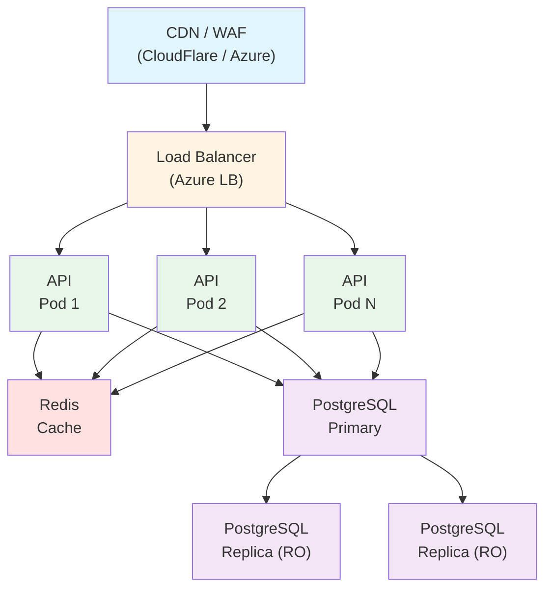

# 🚀 Roadmap: Escalabilidade e Alta Disponibilidade

## ✅ Implementado (POC Atual)

| Categoria        | Item                     | Benefício                          |
| ---------------- | ------------------------ | ---------------------------------- |
| **Performance**  | Busca por PRIMARY KEY    | Consultas otimizadas no PostgreSQL |
| **Performance**  | Hashids para ofuscação   | Decode local sem consulta ao banco |
| **Arquitetura**  | Extension Methods        | Código organizado e manutenível    |
| **Documentação** | Swagger/OpenAPI          | Facilita testes e integração       |
| **DevOps**       | Docker & Docker Compose  | Deploy simplificado                |
| **Qualidade**    | Testes unitários (xUnit) | Cobertura de código crítico        |
| **Database**     | PostgreSQL com sequence  | IDs únicos e performáticos         |

## 🔄 Próximos Passos para Produção

| Prioridade | Categoria                | Item                                     | Impacto                                     |
| ---------- | ------------------------ | ---------------------------------------- | ------------------------------------------- |
| **P0**     | **Cache**                | Redis para códigos frequentes            | Reduz 80%+ de queries ao DB                 |
| **P0**     | **Observabilidade**      | Application Insights / OpenTelemetry     | Monitoramento de performance e erros        |
| **P0**     | **Segurança**            | Rate Limiting (AspNetCoreRateLimit)      | Previne abuso e DDoS                        |
| **P1**     | **Alta Disponibilidade** | Health Checks (Liveness/Readiness)       | Kubernetes auto-healing                     |
| **P1**     | **Escalabilidade**       | PostgreSQL Read Replicas                 | Distribuir carga de leitura                 |
| **P1**     | **Segurança**            | HTTPS obrigatório + HSTS                 | Proteção de dados em trânsito               |
| **P1**     | **Performance**          | CDN (CloudFlare/Azure CDN)               | Redirecionamentos mais rápidos              |
| **P2**     | **Analytics**            | Tabela de estatísticas (cliques, origem) | Business Intelligence                       |
| **P2**     | **Database**             | Particionamento de tabelas               | Melhor performance com milhões de registros |
| **P2**     | **Resiliência**          | Circuit Breaker (Polly)                  | Tolerância a falhas                         |
| **P2**     | **Validação**            | Anti-malware URL scanning                | Segurança contra phishing                   |
| **P3**     | **Features**             | URLs customizadas (vanity URLs)          | Experiência do usuário                      |
| **P3**     | **Features**             | Expiração de URLs (TTL)                  | Gerenciamento de ciclo de vida              |
| **P3**     | **Features**             | API Key authentication                   | Controle de acesso                          |
| **P3**     | **DevOps**               | CI/CD Pipeline (GitHub Actions)          | Deploy automatizado                         |

## 🏗️ Arquitetura de Produção Sugerida

## 📊 Métricas de Sucesso para Escala

| Métrica               | Atual (POC) | Meta Produção |
| --------------------- | ----------- | ------------- |
| **Throughput**        | ~100 req/s  | 10.000+ req/s |
| **Latência (p95)**    | <100ms      | <50ms         |
| **Disponibilidade**   | N/A         | 99.9% (SLA)   |
| **Cache Hit Rate**    | 0%          | >80%          |
| **Tempo de Recovery** | Manual      | <5min (auto)  |
